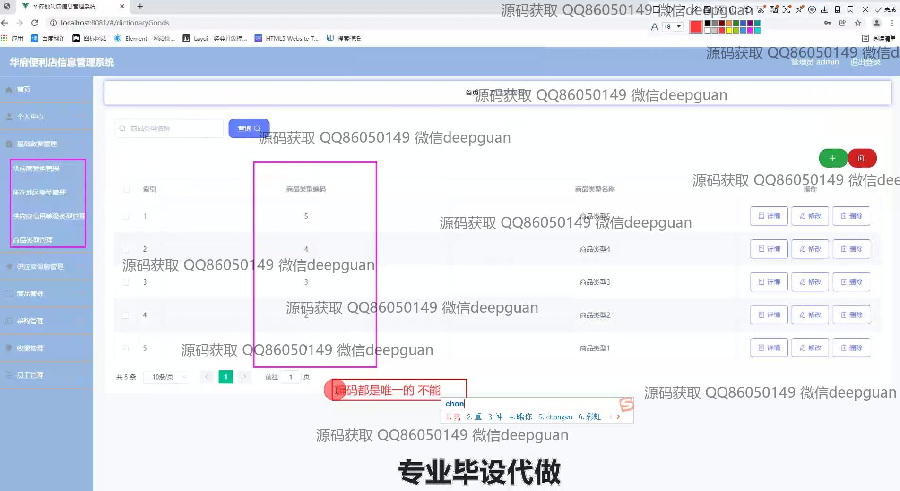
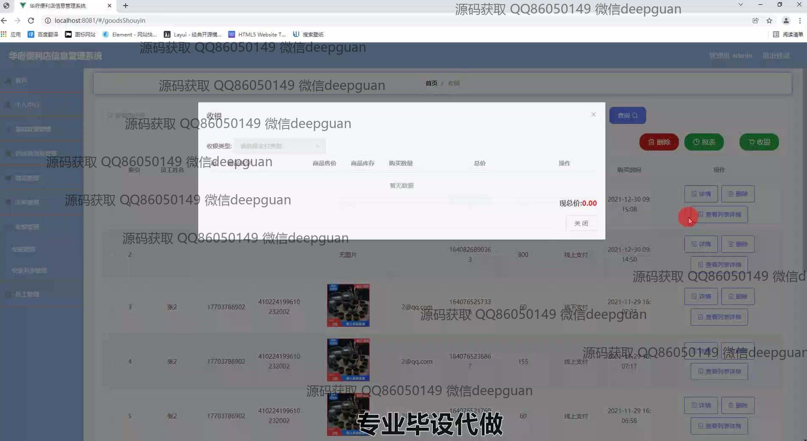
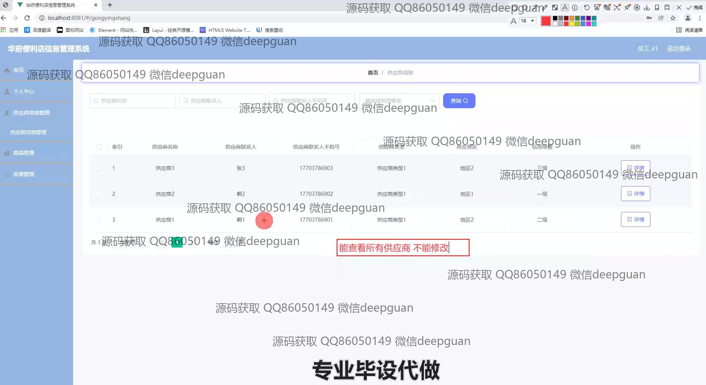

<h1 align="center">华府便利店信息管理系统</h1>

## 简介
华府便利店信息管理系统：角色分为管理员、用户；主要功能包括商品管理、供应商信息管理、员工管理、收银管理、采购管理。系统界面简洁，支持线上支付及详细操作记录，提升便利店运营效率。    --计算机毕业设计源码；毕设源码；java毕业设计源码

## 联系方式

<h3 align="center">获取完整代码与数据库文件 + 微信：deepguan QQ: 86050149 QQ群: 783742310</h3>

<h3 align="center">可帮忙远程部署 包运行成功！提供远程部署、修改代码、设计文档指导、代码讲解等服务！</h3>

## 功能介绍（完整见运行截图）
管理员：登录系统后，可以管理多个模块，包括个人中心、商品管理、采购管理、供应商信息管理、收银管理和员工管理等。可以通过界面执行商品信息的录入、编辑与删除，管理供应商和员工的信息，并可查看和操作收银记录。此外，还能进行数据的搜索、筛选及报表生成。拥有修改密码功能，角色权限可选择性进行角色管理。

员工：可以通过系统登录并访问个人中心，查看自身信息和进行修改。同时可以参与商品、采购及收银管理工作，录入或编辑相关信息，并能够生成和查看相关报表。收银工作中需处理线上和线下支付，确认订单信息并完成结算。

用户：登录系统后可以查看系统首页的模块展示，根据界面提示进行商品的搜索、浏览与购买。完成购买后，可查看并管理个人订单，查阅过往消费记录和相应收银信息。个人中心提供详细的用户信息、订单管理及地址修改功能。

供应商：在系统内，会被管理员录入其信息，如名称、联系人、联系电话及信用等级等。供应商在系统中只能查看自身信息，无权限自行修改确保数据安全性。通过系统监督供应商供货状态及信用信息，也便于管理员全面管理供应链。

## 运行截图

本代码来源于网络,仅供学习参考使用!

